<picture>
  <source media="(prefers-color-scheme: dark)" srcset="./dark.svg">
  <source media="(prefers-color-scheme: light)" srcset="./light.svg">
  
</picture>

### 👋 Hi, I'm Muthukumaran

Technical Lead with **7.5+ years** of hands-on software development across **Educational Technology** and **Clinical Trial Management Systems**. I work end to end, from requirements gathering, system design and architecture to development, testing and deployment, and I lead small, high-performing teams across diverse stacks. I care about scalable, maintainable, high-quality software and I'm passionate about open-source technologies, especially **PHP, JavaScript and Python**.

---

### 🧭 Focus

- **Architecture:** microservices, event-driven architecture, Event Sourcing & CQRS, Domain-Driven Design
- **Quality:** Test-Driven Development, code reviews, mentoring
- **Delivery:** Agile/Scrum, Kubernetes & HELM deployments, CI/CD

---

### 💼 Experience

| Role | Period |
|---|---|
| **Junior Technical Lead** | Feb 2026 – Present |
| **Senior Software Engineer** | Dec 2022 – Jan 2026 |
| **System Analyst** | Dec 2018 – Dec 2022 |

- Code reviews across 6 repositories and mentoring 2 junior engineers.
- Migrated ~200 APIs to Laminas Mezzio in two months with no downtime, alongside the move to Kubernetes and HELM.
- Moved four services (TMS, Fulfillment, Licensing, Enablement API) onto Kubernetes with HELM.
- Introduced Event Sourcing and CQRS on the Licensing service, ran the proof of concept and trained the team.

---

### 🚀 Featured Projects

| Project | What it is | Stack |
|---|---|---|
| **Study Collaboration System (SCS)** | Microservices platform: administration, study management, mailing, integrations, gateway and auth | Ruby on Rails · Vue.js · React · PostgreSQL · Redis |
| **Trainer Management System (TMS)** | Trainer–learner mapping, scheduling, billing and reporting; AWS Cognito SSO; deployed on EKS | PHP (Symfony) · Angular · Node.js · MySQL · Kafka · K8s · HELM |
| **Licensing** | Learner onboarding and license provisioning built on Event Sourcing + CQRS | Node.js · PostgreSQL · EventStoreDB · HELM · K8s |
| **Fulfillment Service** | Course purchases, payments, Salesforce order sync; RabbitMQ with DLQ | Node.js · React · MongoDB · Redis · AWS Lambda |
| **Enablement API** | Core registration/login API; led the ~200-API migration to Mezzio | PHP · Laminas Mezzio · MySQL · MSSQL · K8s |
| **File Management System** | Cloud file sharing for web, Android and iOS, built from scratch | Vue.js · Quasar · Node.js · DynamoDB |

Earlier projects

Corporate Website (Angular, Node.js, bilingual JA/EN) · Tabetan · Migration Assistant · Palmo · Pest Control System · BPM Tool (Ranabase) · CRM Tool · Application Tracking API (Java, Kintone)

---

### 🛠️ Engineering Stack

**Backend** — PHP · Laravel · Symfony · Laminas Mezzio · Node.js · Express · Ruby on Rails · Python
**Frontend** — JavaScript · TypeScript · Vue.js · Quasar · Angular · React · HTML · CSS
**Data** — PostgreSQL · MySQL · MSSQL · MongoDB · DynamoDB · EventStoreDB · Redis · Memcached
**Messaging** — Kafka (StreamNative) · RabbitMQ
**Cloud & DevOps** — AWS (EKS, Lambda, Cognito, SDK) · Kubernetes · HELM · Terraform · GitHub Actions · Bitbucket Pipelines · Datadog
**Tooling** — Git · GitHub · Bitbucket · JIRA

---

### 🏆 Recognition & Learning

- **Shining Star** award (2024) — outstanding contribution and performance in development
- **Newbie Star** award (2023) — quick learning, adaptability and timely delivery
- Certifications: Docker for the Absolute Beginner (Udemy) · Angular (2+) Basic · Laravel Advanced · HTML/CSS Basic (Cutshort) · Full Stack Technologies (JSpiders)
- B.Tech, Mechanical Engineering — Kalasalingam University, 2017
- Languages: English · Tamil · Japanese

---

### 🤝 Connect

